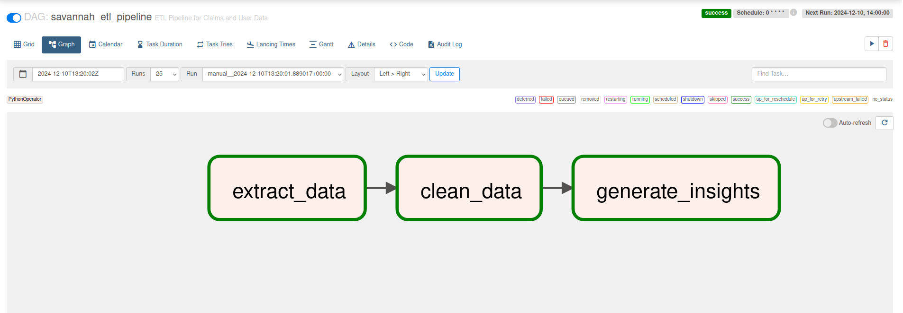
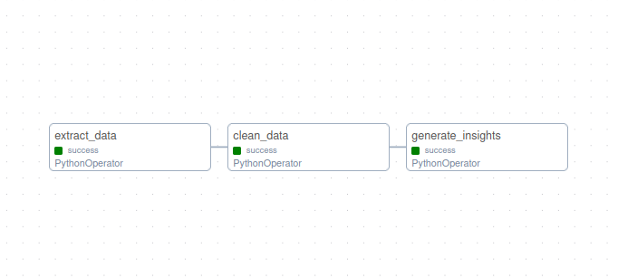

# **Data Engineering Screening Challenge**

This project demonstrates the implementation of a complete ETL pipeline to process claims and user data using Python, Docker, Apache Airflow, and Bash. The pipeline extracts data from APIs, cleans and processes it, and generates enriched datasets with insights.

---

## **Pipeline Overview**

### **Steps**

1. **Extract Data**: Fetch raw data from APIs and save locally as JSON to `data/jsons` directory.
2. **Clean Data**: Process raw JSON into cleaned CSV datasets to `data/cleaned`.
3. **Transform Data**: Generate enriched datasets with user and product insights to `data/insights` directory.
4. **Automate Tasks**: Orchestrate pipeline execution using Apache Airflow.

---

## **Tech Stack**

- **Primary Tools**: Python, Docker, Apache Airflow, Bash.
- **Data Storage**: Local JSON and CSV files.

---

## **Pipeline Design**

The pipeline is structured as an Airflow DAG with the following tasks:

- **Extract Data**:
  - Fetch raw data from APIs and save to `data/jsons/`.
- **Clean Data**:
  - Process raw JSON into cleaned CSV files and save to `data/cleaned/`.
- **Transform Data**:
  - Generate insights and save to `data/insights/`.

## Setup Instructions

1. **Clone the Repository**:

```bash
git clone git@github.com:foscraft/savannah_engineering.git
cd savannah_engineering
```

>> I am using docker and docker compose to roll and deploy the pipeline.

>> If you have docker in your machine (*I honestly think you should! Haha*)

Run the bash script

```bash
bash run.sh
```

How the file looks like

```bash
#!/bin/bash
set -e

mkdir -p scripts

jupyter nbconvert --to script ./notebooks/extract_data.ipynb --output ../scripts/extract_data
jupyter nbconvert --to script ./notebooks/clean_data.ipynb --output ../scripts/clean_data
jupyter nbconvert --to script ./notebooks/generate_insights.ipynb --output ../scripts/generate_insights

docker compose build
docker compose up -d
```

Running this creates the `scripts` directory, later the `data` directory is created and subdirectories `jsons`, `cleaned`, `insights`. The relevant files are created and populated into the directories specified. 

All these happens when the pipeline is tiggered.

The `jupyter nbconvert` command simplifies deployment by converting Jupyter notebooks into Python scripts, which are more suitable for production environments. Scripts integrate seamlessly with version control systems like Git, align with collaborative workflows, and eliminate the need for a Jupyter server, allowing direct execution in any Python environment. This reduces overhead, improves performance, and ensures compatibility with automation tools and deployment pipelines. By automating the conversion, you save time and effort while maintaining the original functionality of the notebooks. This approach streamlines your workflow, enhances maintainability, and aligns with industry best practices for deploying machine learning and data science projects.

- `extract_data.py`

This script automates the process of fetching data from multiple REST API endpoints, handling pagination, and saving the results into JSON files for further use. It is designed to work with three endpoint /carts, /products, and /users available [here](https://dummyjson.com). The script ensures the retrieved data is organized and saved in a specified directory (/opt/airflow/data/jsons), which is created if it does not exist.

For each endpoint, the script iteratively fetches paginated data using a limit and skip mechanism. It aggregates all the results into a single list, which is then saved as a formatted JSON file (e.g., carts.json, products.json, users.json). The script also includes robust error handling to catch and raise exceptions for failed API requests, ensuring reliability. If any error occurs during data fetching, the script halts and prints an error message detailing the issue. This setup is ideal for extracting large datasets from APIs and preparing them for further processing or analysis.

- `clean_data.py`

This script processes and cleans user, product, and cart data stored in JSON files, normalizes it into structured formats using pandas, and saves the cleaned data into CSV files for further analysis or use. It starts by defining a base directory (BASEDIR) where the JSON files (users.json, products.json, and carts.json) are stored and reads their content into Python dictionaries. The script then creates a cleaned directory to store the processed data as CSV files.

For user data, the script extracts and normalizes address details (e.g., street, city, postal code) into separate columns, combines these with other user attributes (e.g., name, gender, age), and renames columns for clarity. For products, it filters out items priced at $50 or less and retains key attributes such as ID, name, category, and price. For cart data, it explodes nested product information into individual rows, calculates the total value of each cart based on product prices and quantities, and reformats the data for better usability. The cleaned datasets are then saved as cleaned_users.csv, cleaned_products.csv, and cleaned_carts.csv, providing a streamlined output for downstream applications or analysis.

- `generate_insights.py`

This script analyzes cleaned data from e-commerce operations, generating insightful summaries that provide valuable business intelligence. It reads preprocessed data from CSV files (cleaned_users.csv, cleaned_products.csv, and cleaned_carts.csv) located in a designated directory (/opt/airflow/data/cleaned). The script creates a new directory for storing the insights (/opt/airflow/data/insights) and ensures it exists before saving the outputs.

The analysis includes three key components: a user summary, a category summary, and enriched cart details. The user summary aggregates data by user_id to calculate each user's total spending and the number of items purchased, enriching the results with user demographic information like age and city. The category summary calculates total sales and items sold for each product category, offering insights into category performance. Lastly, cart details combine user and product information with cart transactions to provide a granular view of each purchase. These insights are saved as CSV files for further review or integration into reporting tools.

*If you have a process you want to add, just write the script, drop it in `scripts` dir and extend the dag by adding the trigger to `dags/etl_pipeline_dag.py` and you're good to go*

Go to  `http://127.0.0.1:4001` on your browser to get started.

Login have a view of the  flow and trigger the worflow.





The pipeline runs `hourly`

## Incase you're having trouble logging in to airflow; reset password.

```bash
docker exec -it savannah_engineering-airflow-webserver-1  bash
```

Then run the following command to create user `savannah` and password `admin`.

```bash
airflow users create --username savannah --firstname savannah --lastname savannah --role Admin --email admin@example.com --password admin
```
Generate the secret key for for airflow (I have created one secret and passed it on `docker-compose.yml`)

```bash
openssl rand -base64 32
```


## FIndings:

1. **Product Category Performance and Customer Spending Trends**: From the product sales data, *womens-watches* stands out with the highest revenue of `$151,399.74`, despite only 8 units sold. This indicates that customers are willing to spend more on high-value items, and premium products have the potential to drive significant revenue. Conversely, womens-bags, with only `$599.99` in total sales from a single unit sold, shows that not all categories have similar sales performance. These findings suggest that *luxury or high-end items, such as watches, tend to yield greater value despite lower volumes*, while other categories, such as motorcycles and vehicles, contribute heavily to revenue but are not sold as frequently. Additionally, smartphones and laptops show consistent demand with higher units sold, but their total sales are more spread across a wider customer base, suggesting a more balanced price point compared to the high-ticket categories.

2. **High-Value Customers and Geographic Distribution**: Analyzing the customer spending data reveals a strong concentration of high-value customers in specific cities, such as *Denver, San Jose, and Dallas*. These cities appear to be hubs of higher consumer spending, with customers like *Carter* in Denver, who has spent a staggering `$274,072.67`, leading the pack. Other cities like San Francisco and San Diego also contribute significantly to overall sales. The demographic data shows that customers aged between `29` and `39` years dominate the higher spending segments. This indicates that customers in their late 20s to late 30s are a key target for premium product categories and suggest a potential market segment for luxury goods such as watches, furniture, and motorcycles.

3. **Customer Purchasing Behavior and Value Proposition**: The combination of total spending and total items sold shows that there is a clear divide between frequent, lower-ticket purchases and occasional, high-ticket purchases. Customers like *Chloe* in Dallas, who made `9` purchases worth `$16,143.72`, and Carter in Denver, who made fewer but larger purchases, suggest that offering a mix of both low and high-value products can attract a diverse customer base. Customers with a higher frequency of purchases tend to spend more overall, even if the average transaction value is lower. This highlights the importance of having products that cater to both price-sensitive buyers and those looking to make more substantial investments in high-ticket items. The overall age group of 29-39 appears to be the most lucrative, confirming that marketing efforts and product offerings should target this age demographic with both affordable and premium product ranges to optimize sales.